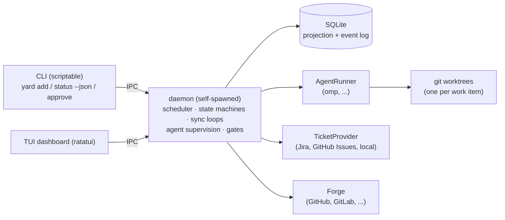

# yardmaster — kickoff spec

> A yardmaster coordinates every track of a rail yard. They never drive a train.

`yardmaster` orchestrates N coding agents working on N tickets, from ticket
intake to merge. Single compiled binary, TUI + scriptable CLI on a shared
daemon, macOS + Linux (WSL covered). Primary goal: **reduce the operator's
mental load** — not raw throughput.

Product decisions and their rationale live in [docs/pm-notes.md](docs/pm-notes.md)
(French). This spec is the engineering contract derived from them.

## Principles

1. **Deterministic core.** The orchestrator never calls an LLM. All
   intelligence lives in agent backends (omp first). yardmaster schedules,
   supervises, gates, syncs, and reports.
2. **Everything is an adapter.** Ticket sources, agent backends, forges,
   notifiers, secret stores: trait objects behind a small core. Zero coupling
   to any employer, tracker, or vendor.
3. **Nothing hardcoded.** Branch naming, commit format, base branch, merge
   policy, check commands: templated per-repo config with sane global
   defaults.
4. **Gated by construction.** Every side effect is classified:
   - 🟢 `local` — worktree edits, local commits, tests → automatic.
   - 🟠 `remote-private` — push to a feature branch → automatic + notification.
   - 🔴 `public` — PR create/edit, comments, merge, tracker transitions →
     explicit human approval, every single time, never remembered.
   Gate levels are configurable per workflow transition and overridable per
   ticket; a profile may lock 🔴 (the author's does).
5. **Local state is a projection.** SQLite caches remote data; remotes stay
   the source of truth for tickets/PRs/CI. Local truth: worktrees, workflow
   states, event log. The daemon continuously re-syncs and reacts to external
   changes (ticket reassigned, review posted, CI finished).
6. **Never touch someone else's ticket.** Assignee filtering is a hard
   invariant enforced in core, not in providers.
7. **Auditable.** Append-only event log per work item: who did/approved/
   published what, when.

## Architecture

One binary, three roles:



- **Daemon**: spawned on demand by the first CLI/TUI invocation (not a system
  service). Owns SQLite, sync loops, agent processes, the gate queue.
  Survives terminal closure.
- **IPC**: Unix domain socket, JSON-lines request/response + event
  subscription. (Windows named pipes later; does not shape the design.)
- **Agents**: portable child-process supervision. No tmux dependency.
- **Worktrees**: one per work item, sibling directory of the repo clone
  (configurable), branch from templated name. Optional per-repo
  `setup-worktree` / `teardown-worktree` hooks (empty by default) — the
  future extension point for port/DB/cache isolation.

### Crates

| crate | contents |
|---|---|
| `yard-core` | domain types, state machine, gate engine, config, event log, adapter traits — no I/O beyond SQLite |
| `yard-daemon` | scheduler, sync loops, agent supervision, IPC server |
| `yard-tui` | ratatui dashboard, IPC client |
| `yardmaster` (root bin) | CLI (clap), daemon self-spawn, TUI launch |

## Domain model

- **Ticket** — projection of a remote issue (provider, key, title, status,
  assignee, deps). Read-mostly.
- **WorkItem** — yardmaster's unit of work: 1 ticket × 1 repo. Owns workflow
  state, worktree path, branch, PR ref, budgets, gate overrides, event log.
  (Cross-repo tickets = N work items later; model doesn't preclude it.)
- **GateRequest** — pending 🔴 approval: action payload (e.g. exact PR body,
  comment text, tracker transition), created-by, resolved-by, verdict.
- **Event** — append-only: `(work_item, ts, actor, kind, payload)`.
- **MergePolicy** — per-repo/per-item predicate over PR snapshot: CI green,
  N approvals, no changes-requested, no conflicts, named checks. Evaluated
  continuously; UI shows `mergeable` + missing reasons.

### Workflow state machine

```
Tracked ─▶ Queued ─▶ Developing ─▶ PrPending(🔴) ─▶ CiWatch ─▶ AwaitingReview
                        ▲              │                │            │
                        │              ▼                ▼            ▼
                     Addressing ◀── feedback ◀── ci-red (≤N retries, then Escalated)
                        │
                        ▼
                    Mergeable ─▶ Merging(🔴) ─▶ Merged ─▶ Done
   (any state) ─▶ Blocked / Escalated  — human unblocks or hands work back
```

- Transitions carry a gate class; defaults follow the 🟢🟠🔴 table above.
- `Groomed` state reserved (agent-assisted ticket refinement, phase 2).
- Base-branch advance: rebase by default (configurable rebase/merge). No
  conflict → agent rebases, 🟠 `push --force-with-lease`. Conflict → agent
  proposes resolution, human approves.
- CI red: agent reads logs, fixes, repushes (🟠); cap (default 3 attempts
  and/or token budget) then `Escalated` with the agent's diagnosis.
- Review feedback: bot comments → agent handles at 🟢/🟠; human comments →
  agent prepares fix + reply, human approves (🔴 for the reply).
- Merge: always a human keypress on `mergeable == true`. No auto-merge.
- Tracker transitions: proposed pre-filled at the right workflow moment,
  applied only through 🔴.

## Adapter traits (sketch)

```rust
trait TicketProvider {
    fn my_tickets(&self) -> Result<Vec<Ticket>>;          // assignee == me, enforced again in core
    fn get(&self, key: &TicketKey) -> Result<Ticket>;
    fn dependencies(&self, key: &TicketKey) -> Result<Vec<TicketKey>>;
    fn available_transitions(&self, key: &TicketKey) -> Result<Vec<TrackerTransition>>;
    fn apply_transition(&self, key: &TicketKey, t: &TrackerTransition) -> Result<()>; // 🔴-gated by core
}

trait AgentRunner {
    fn start(&self, task: AgentTask) -> Result<AgentSessionId>;  // task = ticket ctx + worktree + instructions
    fn resume(&self, id: &AgentSessionId, message: &str) -> Result<()>;
    fn status(&self, id: &AgentSessionId) -> Result<AgentStatus>;
    fn cancel(&self, id: &AgentSessionId) -> Result<()>;
    fn usage(&self, id: &AgentSessionId) -> Result<TokenUsage>;
}

trait Forge {
    fn create_pr(&self, draft: &PrDraft) -> Result<PrRef>;       // 🔴-gated
    fn pr_snapshot(&self, pr: &PrRef) -> Result<PrSnapshot>;     // checks, reviews, comments, conflicts
    fn post_comment(&self, pr: &PrRef, body: &str) -> Result<()>; // 🔴-gated
    fn merge(&self, pr: &PrRef, method: MergeMethod) -> Result<()>; // 🔴-gated
}

trait Notifier { fn notify(&self, n: &Notification) -> Result<()>; }
trait SecretStore { fn get(&self, key: &str) -> Result<Secret>; fn set(&self, key: &str, v: Secret) -> Result<()>; }
```

Gating is enforced in core *around* adapters: adapters never decide, they
execute already-approved actions. Forge/tracker access via direct HTTP APIs
(no `gh`/`acli` dependency); `git` is executed as an external binary.

## Config

Central: `~/.config/yardmaster/config.toml` (XDG on Linux, equivalent on
macOS). Nothing is written into employer repos; an in-repo override file may
come later.

```toml
[profile]
lock_public_gate = true            # 🔴 cannot be relaxed by any other setting

[providers.jira-acme]
kind = "jira"; url = "https://acme.atlassian.net"; user = "me@acme.com"
# token via SecretStore, key "providers.jira-acme"

[repos.backend]
path = "~/dev/backend"
forge = "github"                    # owner/repo inferred from origin
base = "develop"
branch_template = "{type}/{ticket}-{slug}"
check_command = []                  # optional local gate before PR; CI is the truth
rebase = true
merge_policy = { ci = "green", approvals = 1, no_changes_requested = true }
ci_retry_cap = 3

[budgets]
default_tokens_per_item = 0         # 0 = unlimited, tracked regardless
```

Secrets: OS keychain via `keyring` (Keychain / libsecret / Credential
Manager), fallback file `chmod 600`, env vars for headless.

Sync: adaptive polling with backoff + per-provider rate limits (aggressive on
active items, slow elsewhere). No webhooks (laptop tool).

## CLI surface (target)

```
yard                      # TUI dashboard (default)
yard add <ticket> [--repo <name>]
yard status [--json]
yard approve <gate-id> | yard reject <gate-id> [--reason ...]
yard merge <item>         # only when mergeable; still a 🔴 confirmation
yard logs <item>          # agent transcript / events
yard daemon [run|stop]    # explicit control; auto-spawned otherwise
```

## MVP increments

Each shippable and usable alone:

1. **Socle** — config loading, SQLite schema + event log, daemon self-spawn +
   IPC, `yard status`.
2. **Ticket → PR** — `yard add` → worktree → omp runner → PR draft through
   🟢🟠🔴 gates.
3. **TUI** — dashboard (items × state × agent × mergeable), pending-🔴 queue,
   agent logs.
4. **Loops** — auto-sync, CI-watch + capped retry, bot/human feedback
   routing, merge-policy evaluation + manual merge.
5. **Comfort** — proposed tracker transitions, OS notifications, token
   budgets, inter-ticket dependencies (dep graph lives in core; providers
   only feed it).

## Anti-goals

- No web UI. No multi-user server mode.
- Never reimplement an agent; backends are driven black boxes.
- No LLM calls from the orchestrator itself.
- Windows native: someday, via WSL meanwhile; must not shape the design
  (beyond the no-tmux rule already adopted).
